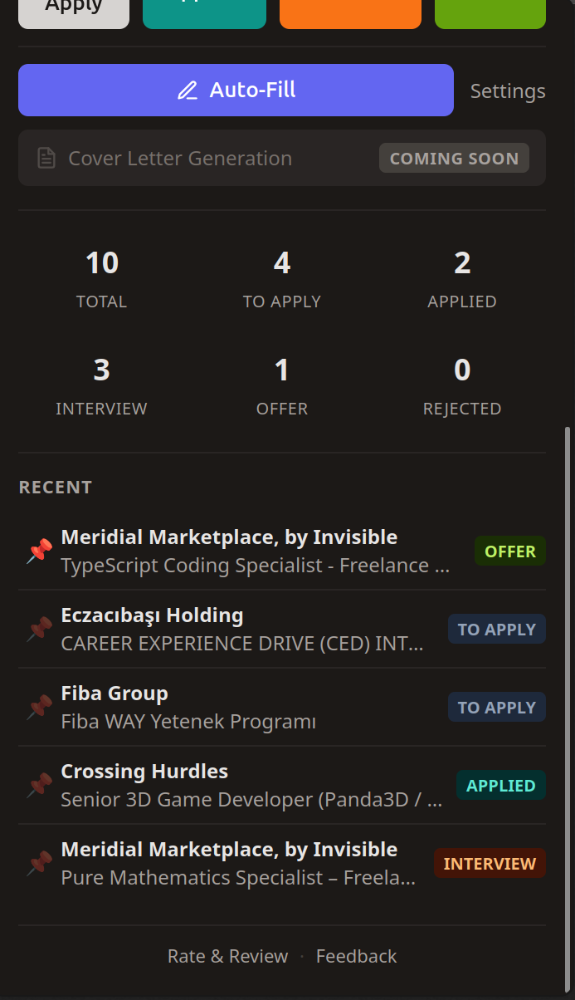
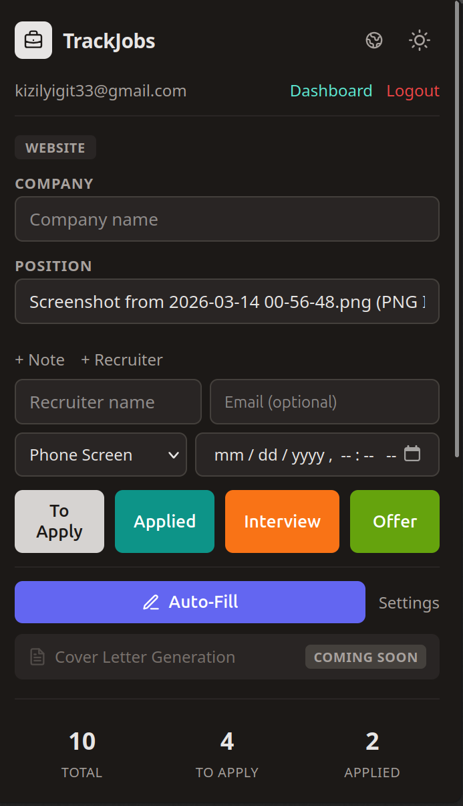
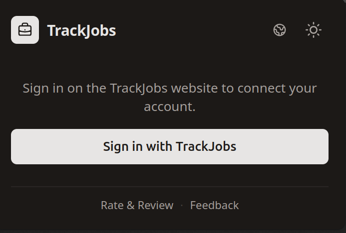

# TrackJobs

**Never lose track of a job application again.**

[**Try It Now**](https://www.trackjobapplications.com) · [Report Bug](https://github.com/yigitcankzl/trackjobapplications/issues)

---

## What is TrackJobs?

TrackJobs is a free, full-stack job application tracker that helps you manage your entire job search from one place. Stop using spreadsheets — track every application, interview, and offer with a modern web dashboard, browser extension, and Gmail add-on.

---

## Features

### Dashboard
Manage your full application pipeline from a single view. Add, edit, and organize applications with advanced filtering, search, sorting, and bulk actions. Switch between table and kanban views. Import applications from CSV/Excel files and export to CSV or PDF.

### Status Tracking
Follow each application through its lifecycle: **To Apply → Applied → Interview → Offer → Rejected/Withdrawn**. Add notes, set interview dates, and get follow-up reminders so nothing falls through the cracks.

### Analytics
Visualize your job search with interactive charts. See status distribution, application pipeline conversion rates, weekly/monthly trends, and source distribution. Track your interview rate and offer rate at a glance.

### Calendar
View all your interviews and application deadlines on a monthly calendar. Never miss an important date.

### Cover Letters
Write, save, and organize cover letters. Link them to specific applications for easy reference. Copy to clipboard or export as PDF.

### Offer Comparison
Compare multiple job offers side by side. Evaluate salary, signing bonus, equity, benefits, remote policy, company size, and more. Use the built-in decision matrix with weighted criteria to make data-driven decisions.

### Browser Extension
Save job listings with one click directly from **LinkedIn**, **Indeed**, **Glassdoor**, and **ZipRecruiter**. The extension captures job title, company, location, and the full job description automatically. Add tags, notes, and recruiter contacts right from the extension popup. Supports auto-filling job application forms with your saved profile.

### Gmail Add-on
Track applications directly from your Gmail inbox. The sidebar automatically extracts company, position, and metadata from job-related emails. Link emails to existing applications or create new ones. Get smart status suggestions based on email content (interview invites, offers, rejections).

### Authentication
Sign in with email/password or use **Google** and **GitHub** OAuth. Secure JWT-based authentication with httpOnly cookies. Email verification and password reset included.

### Multi-language
Full English and Turkish support across the entire application, including SEO meta tags.

---

## Demo

<video src="docs/demo/demo-3-screencast.mp4" width="800" controls autoplay loop muted></video>

---

## Technical Details

See [TECHNICAL.md](TECHNICAL.md) for architecture, tech stack, project structure, deployment, and development guides.

---

## License

MIT © [yigitcankzl](https://github.com/yigitcankzl)
